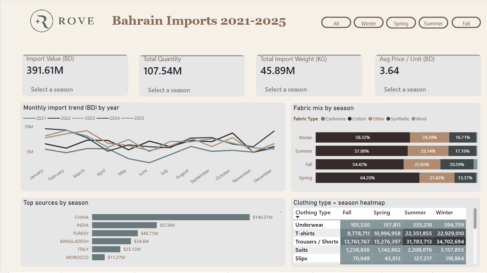
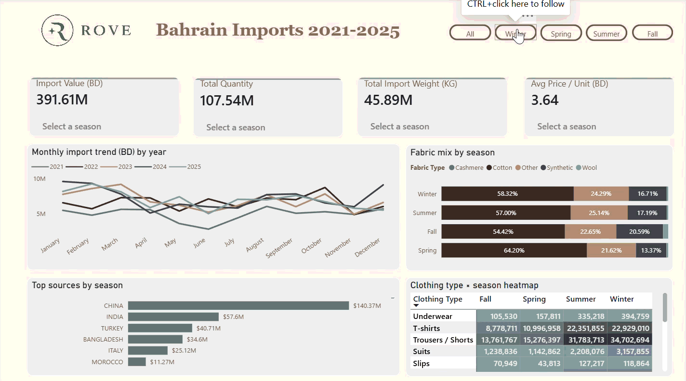
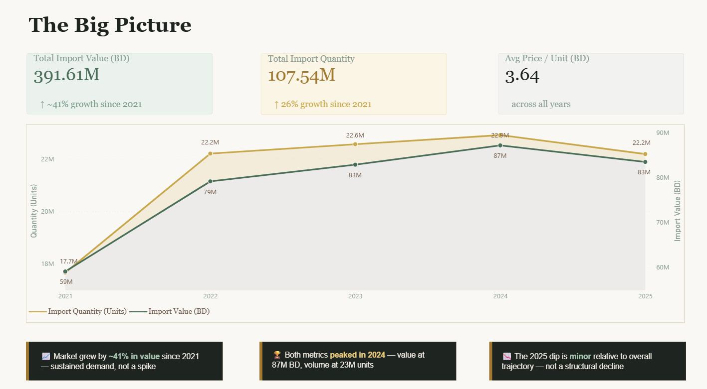
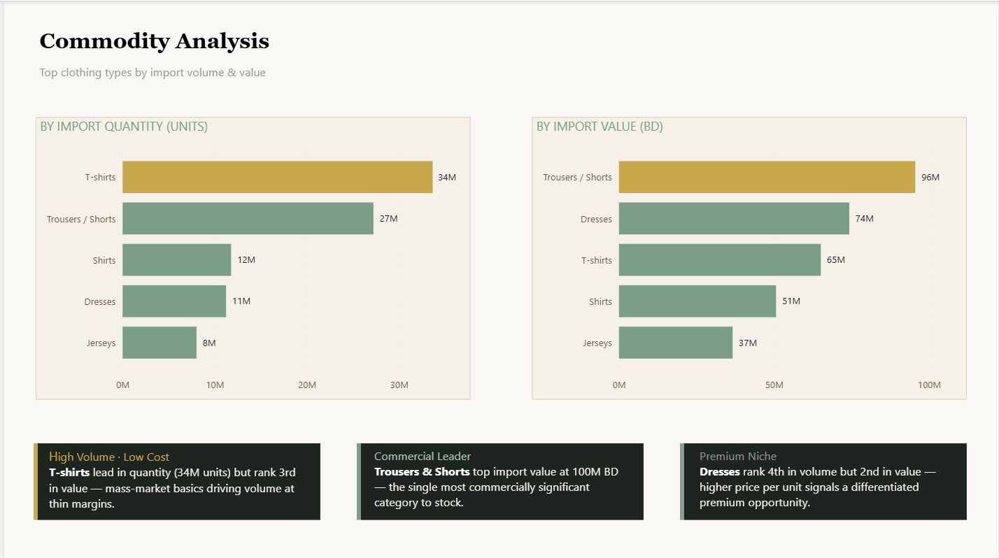
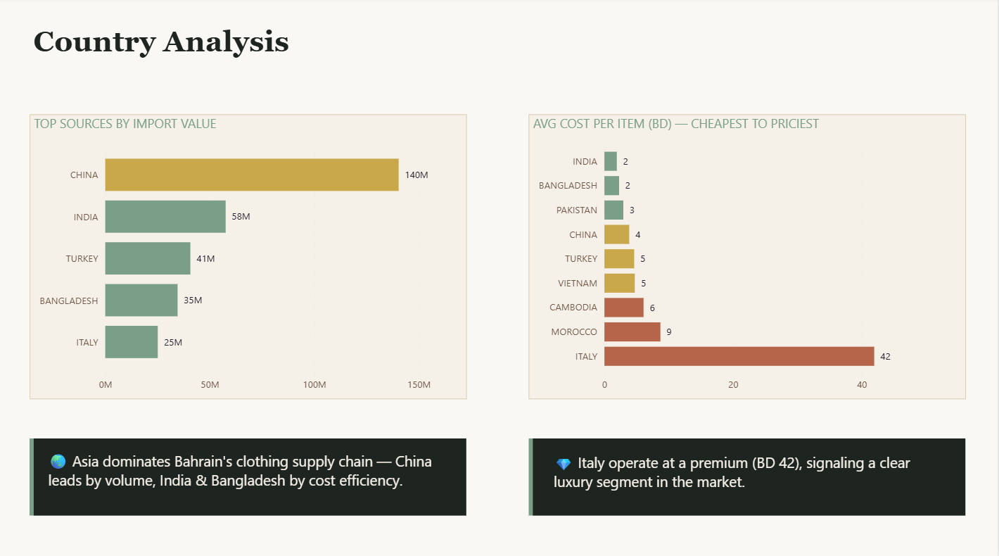
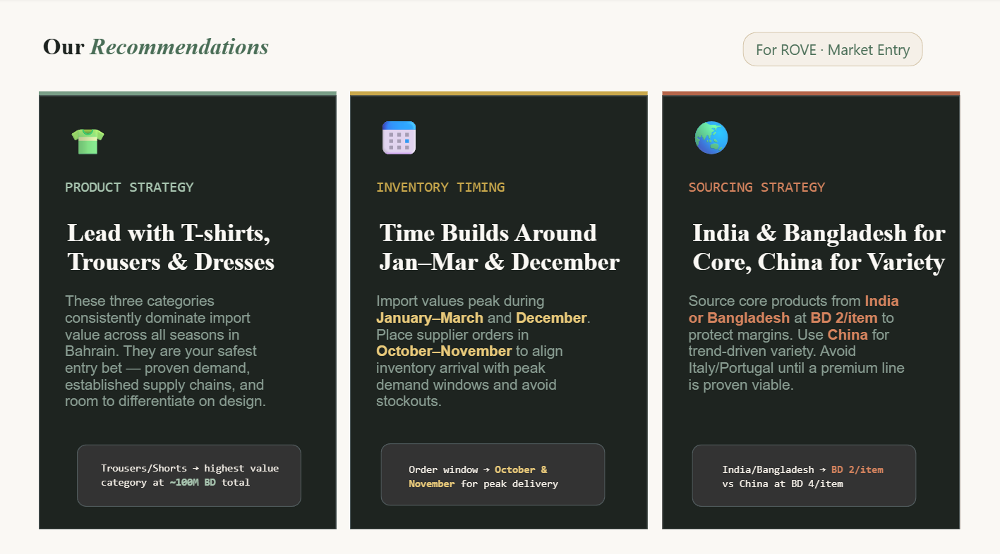

# Bahrain Fast Fashion Market Intelligence Report (2021–2025)

A market intelligence and business intelligence project analyzing Bahrain’s fast fashion import trends to support a data-driven market entry strategy for a new apparel retailer.

---

# Consultancy Scenario

This project was developed as part of a simulated consulting engagement for a fictional GCC market intelligence firm, **Gulf Vision Consulting**.

The client, **ROVE**, is a proposed fast fashion retailer planning to enter Bahrain’s apparel market.

The objective was to provide a fully data-driven market entry strategy using Bahrain’s official import data between 2021–2025.

The analysis focused on:
- Demand trends
- Supplier sourcing
- Seasonal inventory planning
- Import costs
- Trade logistics
- Market opportunities

The final deliverable combined Python-based data preparation with an interactive Power BI executive dashboard.

---

# Data Source

The dataset was obtained from the Bahrain Open Data Portal and contains official Bahrain import records between 2021 and 2025.

### Source
https://www.data.gov.bh/explore/?disjunctive.theme&sort=modified&q=imports

### Dataset Coverage
- Import transactions
- Commodity classifications (HS Codes)
- Supplier countries
- Import values
- Import quantities and weights
- Monthly import activity

---

# Data Dictionary

| Column Name | Description |
| --- | --- |
| `year` | Year of the import record. |
| `month` | Month when the import transaction was recorded. |
| `commodity_no` | Commodity classification code used to identify the apparel product type. |
| `commodity` | Description of the imported clothing item. |
| `un_code` | Country code of the exporting/supplier country. |
| `country_name` | Name of the country exporting the apparel products to Bahrain. |
| `import_value_bd` | Import value measured in Bahraini Dinar (BD). |
| `import_value_usa` | Import value converted to US Dollars (USD). |
| `import_weight_kg` | Total imported weight measured in kilograms. |
| `import_quantity` | Number of imported units/items. |
| `um` | Unit of measurement used for the imported quantity, such as number of items (`NO`). |

---

# Executive Dashboard Preview



---

# Interactive Dashboard Demo



> Interactive Power BI dashboard featuring seasonal filters, sourcing analysis, KPI tracking, heatmaps, and clothing category insights.

---

# Project Overview

This project analyzes five years of Bahrain’s apparel import data to uncover:

- Market growth trends
- High-demand clothing categories
- Seasonal purchasing patterns
- Supplier country performance
- Cost-efficient sourcing opportunities
- Trade and logistics considerations

The goal was to transform raw trade data into actionable business intelligence for a fast fashion brand entering the Bahraini market.

---

# Client Persona

### Client Type
A new fast fashion retailer planning to enter the Bahraini apparel market.

### Business Goals
- Identify high-demand apparel categories
- Source inventory from cost-efficient supplier countries
- Understand seasonal demand behavior
- Build a competitive pricing strategy
- Reduce inventory and sourcing risks

### Target Market
- Young adults and trend-focused consumers
- Mid-range affordable fashion segment
- Seasonal and fast-moving apparel products

---

# Business Problem

ROVE, a new fast fashion retailer entering Bahrain, lacked visibility into:

- Which apparel categories dominate Bahrain’s import market
- Which sourcing countries provide the best cost efficiency
- Which months experience peak seasonal demand
- Which product categories present the strongest commercial opportunity
- How import trends evolved between 2021–2025

Without data-driven visibility, inventory planning, sourcing strategy, and pricing decisions carried significant commercial risk.

This project transformed raw Bahrain import data into strategic business intelligence to support a confident market entry strategy.

---

# Business Questions Answered

- Which apparel categories generate the highest import value?
- Which products dominate import volume?
- Which supplier countries provide the lowest average cost per item?
- How has Bahrain’s apparel market grown between 2021–2025?
- Which months and seasons experience peak demand?
- Which categories present premium market opportunities?
- Which sourcing markets provide the best balance between cost and lead time?

---

# Key Insights

## Market Growth Analysis



- Bahrain’s apparel import value increased by approximately **41%** between 2021 and 2025
- Total import value peaked at **BD 87M** in 2024
- Growth remained consistent across multiple years, signaling sustained market demand
- Total import quantity exceeded **107M units** across the analysis period

---

## Commodity Analysis



### Highest Import Value Categories
- Trousers & Shorts — BD 96M
- Dresses — BD 74M
- T-shirts — BD 65M

### Key Findings
- T-shirts dominated import volume but operated on thinner margins
- Dresses showed strong premium positioning potential
- Trousers & Shorts represented the largest commercial opportunity

---

## Supplier Country Analysis



### Key Findings
- China dominated total import value
- India and Bangladesh offered the lowest average cost per item (~BD 2)
- Italy operated as a premium-priced supplier market

### Business Implication
India and Bangladesh provide the strongest balance between:
- Low sourcing cost
- Shorter lead times
- High apparel manufacturing volume

---

## Seasonal Demand Insights

### Key Findings
- Demand peaks occurred during:
  - January–March
  - December
- Seasonal patterns remained relatively consistent across multiple years
- Winter and Summer represented the strongest inventory periods

### Business Implications
Retailers should align supplier ordering cycles during:
- October
- November

This helps ensure inventory arrives before peak seasonal demand periods and reduces the risk of stock shortages.

---

# Logistics & Import Operations Analysis

Beyond market trends, the project also analyzed Bahrain’s apparel import process and operational considerations.

## Areas Covered
- Customs procedures
- Import duties and VAT
- Sea vs air freight tradeoffs
- Supplier lead times
- Port clearance process
- Shipment planning strategies

## Key Findings
- India and Bangladesh provided the strongest balance between low cost and short lead times
- Sea freight was the most cost-effective option for bulk inventory imports
- Air freight was best suited for urgent trend-reactive replenishment
- Bahrain’s apparel imports are typically subject to customs duties and VAT charges

---

# Strategic Recommendations



### Product Strategy
Focus on:
- T-shirts
- Trousers & Shorts
- Dresses

These categories consistently dominated Bahrain’s import market and represented the strongest commercial opportunity.

### Sourcing Strategy
- Source core inventory from India and Bangladesh
- Use China for high-variety trend-driven inventory
- Delay premium sourcing markets until brand positioning matures

### Inventory Timing
Align purchasing cycles around:
- Q1 demand peaks
- December seasonal demand

This helps optimize stock availability and reduce inventory shortages during high-demand periods.

---

# Data Preparation Workflow

Python was used to prepare and standardize the raw Bahrain import datasets before loading into Power BI.

## Data Preparation Tasks
- Combined 2021–2025 import datasets
- Cleaned commodity descriptions
- Removed newline characters
- Standardized HS commodity codes
- Fixed inconsistent country naming
- Created calculated business metrics
- Built seasonal classifications
- Derived clothing categories from commodity descriptions

---

# Dashboard Features

The Power BI dashboard includes:
- Dynamic seasonal filtering
- Interactive sourcing analysis
- KPI cards
- Commodity heatmaps
- Import trend analysis
- Supplier benchmarking
- Fabric composition analysis
- Growth tracking measures
- Conditional formatting indicators

---

# Power BI Development

The dashboard includes:
- Custom DAX KPI measures
- Conditional formatting logic
- Seasonal trend calculations
- Dynamic filtering
- Business-focused data modeling

---

# Limitations

- The dataset only includes import activity and does not include local retail sales performance.
- Import data reflects wholesale and landed costs rather than consumer pricing.
- Some commodity descriptions were generalized, limiting product-level precision.
- Visual apparel style classifications were unavailable.
- Gender demand segmentation could not be validated using consumer sales data.
- Inflation, logistics disruptions, and macroeconomic variables were not included.

---

# Future Improvements

- Integrate retail sales and customer behavior data
- Include forecasting models for seasonal demand
- Add supplier risk analysis and logistics KPIs
- Incorporate product image classification models
- Develop automated Power BI refresh pipelines

---

# Tech Stack

## Data Analysis
- Python
- Pandas

## Data Visualization
- Power BI

## Data Processing
- Data Cleaning
- Data Transformation
- KPI Development
- Trend Analysis
- DAX Measures

---

# Repository Structure

```bash
.
├── data/
├── images/
│   ├── dashboard-overview.png
│   ├── dashboard-demo.gif
│   ├── market-growth.png
│   ├── commodity-analysis.png
│   ├── country-analysis.png
│   ├── recommendations.png
│   └── dax-measures.png
├── notebooks/
│   ├── bahrain_imports_clean.ipynb
│   └── fast_fashion_filter.ipynb
├── dashboard/
│   └── Bahrain_Fast_Fashion.pbix
└── README.md
```
